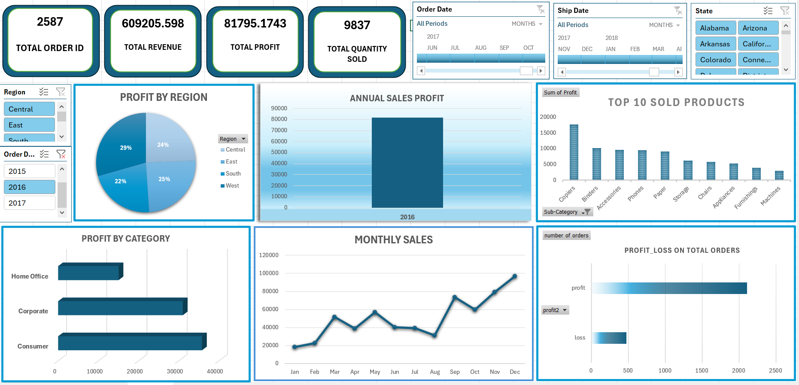

# Superstore-Sales_Excel-Dashboard
Project Overview

This project presents an interactive Sales Performance Dashboard built using Microsoft Excel to analyze sales, profit, and order trends across regions, categories, and time periods.

The dashboard provides valuable insights into business performance, helping stakeholders make data-driven decisions to improve profitability and operational efficiency.

 Dashboard Preview

Objectives

The main objectives of this project are:

• Analyze overall sales and profit performance
• Identify top-performing products and regions
• Track monthly sales trends
• Compare profit across different customer segments
• Identify profit and loss areas

Tools and Technologies Used

• Microsoft Excel
• Pivot Tables
• Pivot Charts
• Slicers
• Data Cleaning
• Dashboard Design

Key Performance Indicators (KPIs)

The dashboard tracks the following KPIs:

• Total Orders: 2,587
• Total Revenue: 609,205
• Total Profit: 81,795
• Total Quantity Sold: 9,837

Dashboard Features
1. Profit by Region

Shows profit distribution across:

• Central
• East
• South
• West

Insight: West region contributes the highest profit.

2. Annual Sales Profit

Displays yearly profit trends.

Insight: Strong profit performance observed in 2016.

3. Top 10 Sold Products

Highlights best-selling product categories such as:

• Copiers
• Binders
• Accessories
• Phones

Insight: Copiers generate the highest profit.

4. Profit by Category

Compares profit across customer segments:

• Consumer
• Corporate
• Home Office

Insight: Consumer segment generates the highest profit.

5. Monthly Sales Trend

Shows sales performance month-wise.

Insight:

• Sales increase significantly toward year end
• Highest sales observed in December

6. Profit vs Loss Analysis

Shows comparison between profit and loss orders.

Insight: Majority of orders are profitable.

Filters Available

Interactive filters allow users to analyze data by:

• Region
• State
• Order Date
• Ship Date

Business Insights and Recommendations

Based on the analysis, the following recommendations can improve business performance:

• Focus more on high-profit products like Copiers
• Improve performance in low-profit regions
• Reduce loss-making orders
• Increase marketing during high-sales months
• Target high-value customer segments

Files Included
File Name	Description
Sales Dashboard.xlsx	Excel Dashboard File
dataset.xlsx	Raw Dataset
excel dashboard.png	Dashboard Screenshot
README.md	Project Documentation
Skills Demonstrated

This project demonstrates the following skills:
• Data Analysis
• Dashboard Development
• Data Visualization
• Excel Pivot Tables
• Business Insight Generation

Author
Ishika Yadav
Aspiring Data Analyst
